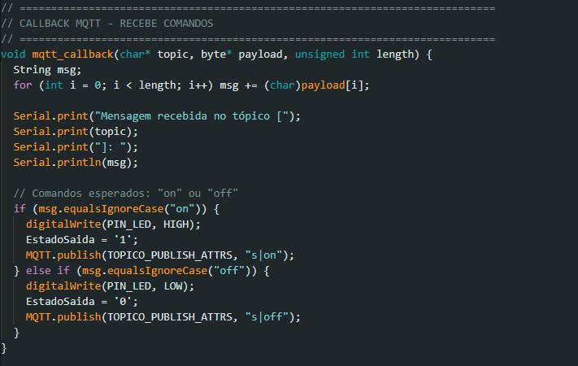
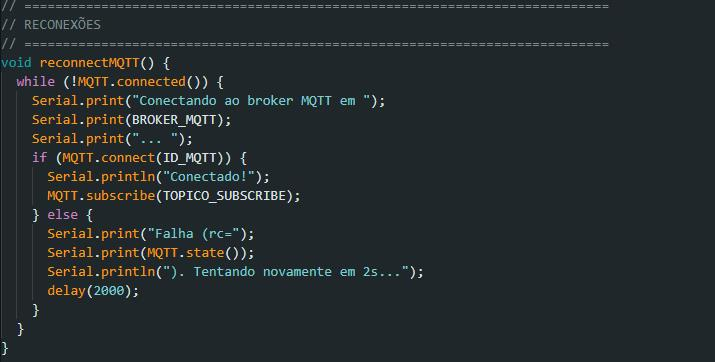

# Projeto IoT: Monitoramento de Temperatura, Umidade e Luminosidade com  ESP32 e MyMQTT

> <h3>Integrantes</h3>
<h4>Kauai Rosa</h4>
<h4>Bruno Gama</h4>
<h4>Murilo Bastos</h4>
<h4>Lucas Pedro</h4>

<strong>
Neste projeto, vamos utilizar o ESP32 para coletar dados de dois sensores: DHT11 (temperatura e umidade) e LDR (luminosidade). Esses dados serão enviados e recebidos via MQTT, utilizando o aplicativo MyMQTT para monitoramento em tempo real.
</strong>

>> Objetivos:
<li>Medir a temperatura e a umidade com o sensor DHT11.</li>

<li>Medir a intensidade luminosa com o sensor LDR</li>

<li>Transmitir e receber dados via MQTT utilizando o aplicativo MyMQTT.<li>

<li>Utilizar o ESP32 para integrar todos os componentes de hardware e fazer a comunicação via Wi-Fi.</li>

# Monte você também!

Siga os passos abaixo

> <h3>Siga este padrão de montagem:</h3>

 

>> <h3>Depois que montar basta implementar os passos abaixo.</h3>

<h4>Userconfig</h4>

<h4>Variaveis Globais</h4>

<h4>Inicialização</h4>

<h4>Chamadas</h4>

<h4>Reconexão</h4>

<h4>Publicação de Dados</h4>

<h4>Main Loop</h4>

<h4>Saida:</h4>

>> <h3>Deixamos acima em .txt o código completo, para facilitar!!</h3>

#

<h2>Nós da ©Company 404 agradecemos sua atenção!👋</h2>

